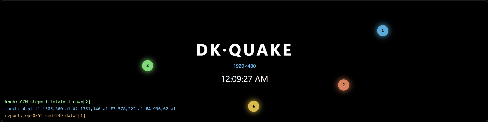

# DecoKee QUAKE

<p align="center">
  
</p>

A clean desktop base for driving the **DecoKee QUAKE** display — the wide,
jog-wheel touch panel shown above. It connects to the PC as an HDMI monitor for
its image and over USB HID for input, and this app keeps it awake, paints a
fullscreen window on it, and exposes its device controls.

The QUAKE is a wide touch panel that connects to the PC as an **HDMI monitor**
(labelled `DK-QUAKE`, 1920×480) for its image, plus **USB HID** for its touch
surface, jog wheel and buttons. This app keeps the panel awake, renders a
fullscreen window on it, and exposes its device settings — a minimal base to
build on.

> Derived from the open-source [DecoKeeAI](https://github.com/DecoKeeAI/DecoKeeAI)

## Features

- **Keeps the panel lit** — sends the firmware keep-alive watchdog so the
  backlight stays on (the panel blanks without it).
- **On-panel window** — a borderless fullscreen window pinned to the `DK-QUAKE`
  display, rendering content on the panel.
- **Device settings** — firmware version, brightness, mic, buzzer, and
  enter-download-mode (DFU) for firmware updates.
- **Input** — jog-wheel (rotate/press) and multi-touch, read over HID.
- **`quake-device` package + CLI** — a standalone, Electron-free library and
  test CLI for the QUAKE protocol (see [modules/quake-device](modules/quake-device)).

## Stack

electron-vite 2 · Vue 3 · Element Plus · Electron 33 · node-hid

## Prerequisites

This project builds several native addons (`node-hid`, `robotjs`, `active-win`,
`uiohook-napi`, `sharp`), so you need **Node.js 18+** (Node 20 LTS recommended),
**Python 3**, and a **C/C++ toolchain**:

- **Windows** — [Visual Studio Build Tools](https://visualstudio.microsoft.com/downloads/)
  with the *Desktop development with C++* workload (MSVC + Windows SDK), and Python 3.
- **macOS** — Xcode Command Line Tools: `xcode-select --install`.
- **Linux (Debian/Ubuntu)** — build tools and the X11 headers the input/automation
  addons need:
  ```bash
  sudo apt-get install build-essential python3 \
    libx11-dev libxtst-dev libxinerama-dev libxkbcommon-dev libxkbcommon-x11-dev \
    libpng-dev
  ```

Native modules are rebuilt against Electron's ABI automatically on `npm install`
(via `electron-builder install-app-deps`); if you change Node/Electron versions,
run `npm run rebuild`.

## Develop

```bash
npm install
npm run dev
```

If `npm run dev` reports `require('electron')` returning a path string, your
shell has `ELECTRON_RUN_AS_NODE=1` set; the dev launcher
([scripts/dev.mjs](scripts/dev.mjs)) clears it automatically.

## Build

```bash
npm run build          # bundle main + renderer
npm run build:win      # Windows x64 installer (electron-builder)
npm run build:linux    # Linux
npm run build:mac      # macOS
```

## quake-device CLI

The protocol library doubles as a test CLI (runs under plain Node — no Electron):

```bash
node modules/quake-device/cli.js list          # list attached QUAKE interfaces
node modules/quake-device/cli.js info          # firmware version
node modules/quake-device/cli.js wake 30       # screen on + keep-alive for 30s
node modules/quake-device/cli.js monitor       # stream knob / touch / reports
node modules/quake-device/cli.js touch         # stream touch points
```

Close the app first — a HID interface can only be opened by one process at a time.
